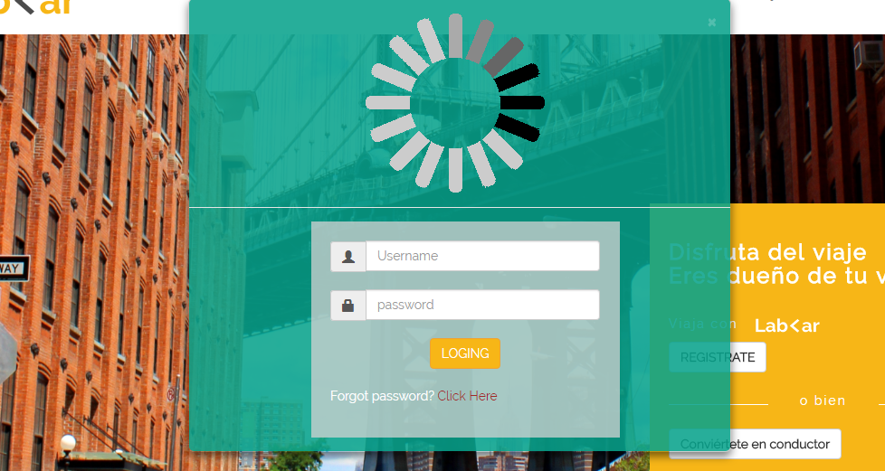
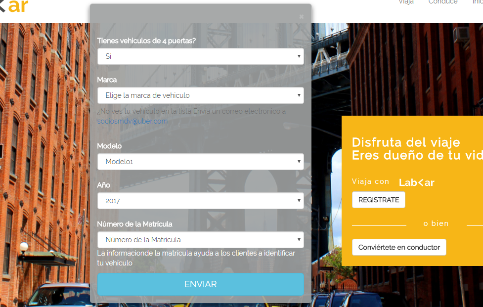

# MI PAGINA(WIKI)

* **Track:** _Common Core_
* **Curso:** _Crea tu propia red social_
* **Unidad:** _No reinventes la Rueda_

***

Replicamos la pagina Lab Car de manera responsive para mobile y para desktop con la libreria de *BOOTSTRAP*

## Desarrollo:
* LA VERSION DESKTOP

* LA VERSION MOBILE

En nuestro diseño de mobile se utilizo las grillas y las imagenes responsive

* MODAL DE LOGIN

* MODAL DE REGISTRAR CONDUCTOR

* MODAL DE REGISTRAR CONDUCTOR

