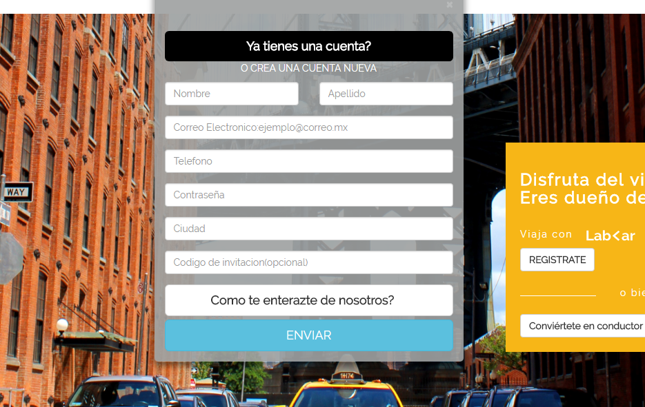

# LAB-CAR (BOOTSTRAP)

* **Track:** _Common Core_
* **Curso:** _Crea tu propia red social_
* **Unidad:** _No reinventes la Rueda_

***

Replicamos la pagina Lab Car de manera responsive para mobile y para desktop con la libreria de *BOOTSTRAP*.

# Desarrollo:
*  VERSION DESKTOP

*  VERSION MOBILE

En nuestro diseño de mobile se utilizo las grillas y las imagenes responsive

# MODALES

Como extra tenemos los modales necesarios en la versión web,utilizando el bootstrap para modales.

## Modal de Inicia Sesión 

## Modal de Regístrate

## Modal de Convierte en conductor

